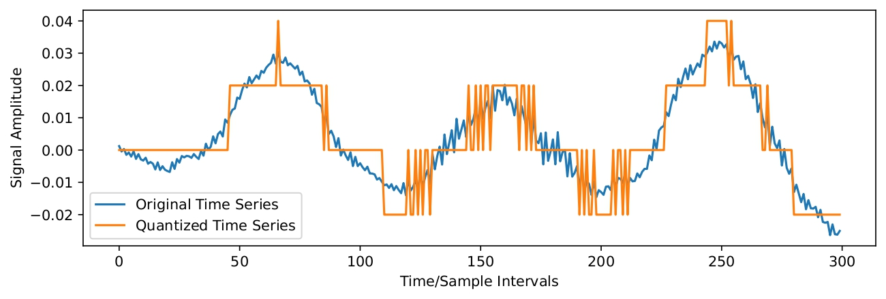

This article is 100% human-written. 
**Problem Statement**  
Time series are sometimes quantized, for example in order to save memory. For coarse quantization, this means that we lose quite a lot of information - or does it?

  

Attempting to reconstruct the blue curve using only the orange curve seems like an ill-defined problem, and in general, it is. But practically, we might be able to do quite well.  
**Reconstruction Bias**  
Analogously to the need of an inductive bias in machine learning, reconstruction requires a bias too: Given the quantized signal, there is an infinite number of possible reconstructions, so we need to specify a preference for some of them over others. We can do this by assuming a model class for the original time series, for example an autoregressive model:\begin{align}x_t = \sum_{i=1}^p \phi_i x_{t-i}+w_t, \quad w_t \sim \mathcal{N}(0, \sigma^2)\end{align}
Marginalizing over all possible autoregressive models will surely be intractable, so we need to use a point estimate of $$p$$, $$\{\phi_i\}$$, and $$\sigma^2$$. We can then use this point estimate to estimate $$x_{1:T}$$ from $$y_{1:T}$$ using state estimation methods. For now, it will be useful to assume that we have an estimate of $$p$$, $$\{\phi_i\}$$, and $$\sigma^2$$, and focus on the state estimation step. We will see how we can turn the ability to do state estimation into a parameter estimation algorithm afterwards.    

**State Estimation** 
State estimation can be done 

